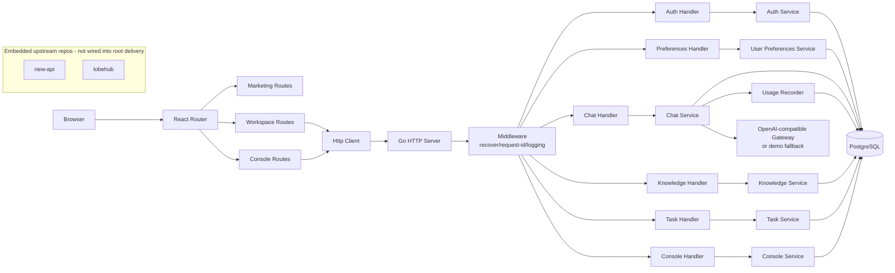

# Historical Material Notice

> 本文件属于历史阶段材料，不再作为当前现状、优先级判断或里程碑规划依据。
> 当前唯一执行基线请改看：`CURRENT_STATUS.md`、`ROADMAP.md`、`docs/architecture/current-system-contracts.md`

# Oblivious 代码库系统分析报告

日期：2026-04-04  
分析范围：`/home/shirosora/code_storage/Oblivious`

## 0. 结论摘要

本仓库当前呈现为“主线应用 + 嵌入上游独立仓”的混合形态：

- 主线交付物是 `src/server` 和 `src/web`。
- `new-api` 与 `lobehub` 在目录上属于当前工作区，但并未纳入根仓当前交付主线。
- 后端 `src/server` 已经超出 Task 5 设计文档中的“基础骨架”阶段，实际上实现了认证、偏好、聊天、知识库、SOLO 任务、控制台统计和 PostgreSQL 持久化。
- 前端 `src/web` 处于“测试目标和页面草稿先行、实现尚未收敛”的状态；多个模块之间存在静态契约断裂，推断当前前端无法稳定通过类型检查和完整构建。
- 当前最大风险不是“后端未实现”，而是“设计文档滞后、前后端契约漂移、前端主路径尚未收敛”。

## 1. 仓库范围与子系统定位

### 1.1 根仓职责

根 `package.json`、`pnpm-workspace.yaml` 和 `scripts/*.sh` 表明，当前根仓真正被脚本编排的主线只有：

- `src/web`：React + Vite 前端
- `src/server`：Go 后端

根脚本仅提供：

- `dev:web` / `test:web` / `check:web`
- `dev:server` / `test:server` / `check:server`

`pnpm-workspace.yaml` 仅声明了 `src/web` 作为 pnpm workspace；`src/server` 通过 shell 脚本单独运行 Go 命令。

### 1.2 嵌入仓定位

`git status --short` 显示根仓下存在未跟踪目录：

- `new-api/`
- `lobehub/`

同时这两个目录本身都带有独立 `.git` 目录，说明它们更接近“嵌入的独立上游仓/参考实现”，而不是当前根主线的已纳管交付物。  
因此本报告采用双层视角：

- 主报告重点分析 `src/server` + `src/web`
- 对 `new-api` / `lobehub` 只做定位说明与显式 marker 摘要，不将其默认计入当前主线 backlog

### 1.3 当前系统边界判断

| 子系统 | 当前状态 | 是否属于主线 |
| --- | --- | --- |
| `src/server` | 已实现真实业务骨架 | 是 |
| `src/web` | 页面与测试较多，但实现未收敛 | 是 |
| `new-api` | 独立大型上游 Go 服务 | 否，嵌入参考仓 |
| `lobehub` | 独立大型前后端一体仓 | 否，嵌入参考仓 |

## 2. 项目现状分析

### 2.1 已实现核心功能模块与能力边界

#### 后端 `src/server`

| 模块 | 已实现能力 | 当前边界 |
| --- | --- | --- |
| 启动与配置 | `cmd/server` 启动、优雅退出、环境变量加载、数据库连接 | 配置项存在未用字段，部署契约未收敛 |
| HTTP 基础设施 | `net/http` 路由、recover、request id、访问日志、统一 JSON envelope | 未见 CORS 中间件；错误语义仍偏基础 |
| 认证与会话 | 注册、登录、登出、会话查询；基于服务端会话表和 Cookie | 无 CSRF、防爆破、会话轮换、权限分层 |
| 用户偏好 | 获取/更新 onboarding、默认模式、模型策略、网络提示等偏好 | 仅基础配置，无更细粒度工作区策略 |
| 聊天 | 会话列表/创建、消息列表/发送、会话配置读取/更新、转任务草稿 | 无流式输出、无真正工具执行、无多提供商抽象 |
| LLM 网关 | OpenAI-compatible `/chat/completions` 请求封装 | 若未配置 `LLM_BASE_URL` / `LLM_API_KEY`，退化为 demo reply |
| 知识库 | 知识库 CRUD、文档 CRUD、与会话配置关联知识库 ID | 没有 ingestion、切片、索引、检索、召回 |
| SOLO 任务 | 任务创建、查询、开始、批准、暂停、恢复、取消、预算更新 | 仅 starter 状态机，不是真正 agent runtime |
| 控制台 | usage / access / models / billing 统计接口 | 偏 starter 级别汇总，非完整运营后台 |
| 数据层 | PostgreSQL 连接、迁移文件、各模块 SQL store | 未见 repository 抽象统一规范；集成测试强依赖本地 PostgreSQL |

#### 前端 `src/web`

| 模块 | 已实现能力 | 当前边界 |
| --- | --- | --- |
| 基础框架 | React 18、React Router、Vite、Vitest 基础搭建 | 无统一全局状态上下文落地 |
| 营销页 | 首页、登录、注册路由已挂载 | 深度功能较少 |
| 工作区布局 | `WorkspaceLayout`、`ConsoleLayout` 已存在且有测试 | 路由接入不完整 |
| Chat 页面 | 当前仅占位 `<h1>Chat</h1>` | 与测试预期的复杂交互完全不一致 |
| SOLO 页面 | 页面实现较多，包含表单、任务列表、预算、工具边界、结果导出、继续聊天 | 路由未挂载；依赖的 API 契约并未完整实现 |
| Knowledge 页面 | 页面实现较多，包含知识库/文档 CRUD 草稿 | 路由未挂载；依赖 `useAppContext`、`put/delete` 等不存在实现 |
| Onboarding / Settings | 当前仅占位页 | 测试预期明显超前 |
| 控制台页 | 已挂载 usage/models/billing/access 路由 | 需进一步核对页面成熟度和后端契约 |

#### 关键能力边界结论

1. 后端当前是“可运行的业务壳”，不是占位 scaffold。
2. 前端当前是“目标态 UI 和测试用例先行”，不是完成态产品。
3. 知识库和 SOLO 都已具备数据结构与页面草稿，但核心智能能力尚未落地。

### 2.2 系统架构图



### 2.3 组件依赖与交互流程

#### 认证流程

1. 前端调用 `/api/v1/auth/register` 或 `/api/v1/auth/login`
2. 后端 `authHandler` 解码凭据
3. `auth.Service` 调用 `auth.SQLStore`
4. 注册时使用 `bcrypt` 生成密码哈希并创建用户、默认工作区、会话
5. 登录时校验密码哈希并创建新会话
6. `authMiddleware` 将 session id 写入 HttpOnly Cookie
7. 后续受保护接口通过 Cookie 查询会话并注入 request context

#### 聊天流程

1. 前端调用会话或消息接口
2. `chat.Service` 读写 conversation/message/config
3. 发送消息时合并会话配置与请求覆盖项
4. `HTTPReplyGenerator` 调用 OpenAI-compatible `/chat/completions`
5. 若模型网关未配置，则回退为 `Assistant reply: <最后一条用户消息>`
6. 写入 assistant 消息，并记录 usage

#### 知识库流程

1. 前端 CRUD 知识库和文档
2. `knowledge.SQLStore` 直接操作 `knowledge_bases` / `knowledge_documents`
3. 当前只做结构化持久化，不做索引和检索

#### SOLO 流程

1. 创建任务时写入执行模式、授权范围、工具白名单/黑名单、预算、知识库绑定
2. 开始任务后，根据执行模式将任务置为 `running` 或 `awaiting_confirmation`
3. 批准后继续推进状态
4. `resume` 当前会直接把 starter 流标记为完成，并生成固定格式结果摘要

### 2.4 后端接口文档

#### 统一响应约定

- `GET /healthz`：直接返回 `{ "status": "ok" }`
- 其他业务接口：统一 envelope

```json
{
  "ok": true,
  "data": {},
  "error": null
}
```

失败时：

```json
{
  "ok": false,
  "data": null,
  "error": {
    "code": "invalid_request",
    "message": "..."
  }
}
```

#### Auth

| Method | Path | 鉴权 | 说明 |
| --- | --- | --- | --- |
| `POST` | `/api/v1/auth/register` | 否 | 注册用户并创建默认工作区与会话 |
| `POST` | `/api/v1/auth/login` | 否 | 登录并创建会话 |
| `GET` | `/api/v1/auth/me` | 是 | 读取当前会话、用户、工作区、偏好 |
| `POST` | `/api/v1/auth/logout` | 是 | 删除会话并清 Cookie |

#### Preferences / Models

| Method | Path | 鉴权 | 说明 |
| --- | --- | --- | --- |
| `GET` | `/api/v1/app/me/preferences` | 是 | 获取用户偏好 |
| `PUT` | `/api/v1/app/me/preferences` | 是 | 更新用户偏好 |
| `GET` | `/api/v1/app/models` | 是 | 获取可选模型列表 |

#### Chat

| Method | Path | 鉴权 | 说明 |
| --- | --- | --- | --- |
| `GET` | `/api/v1/app/conversations` | 是 | 会话列表 |
| `POST` | `/api/v1/app/conversations` | 是 | 创建会话 |
| `GET` | `/api/v1/app/conversations/{id}/messages` | 是 | 消息列表 |
| `POST` | `/api/v1/app/conversations/{id}/messages` | 是 | 发送消息并生成回复 |
| `GET` | `/api/v1/app/conversations/{id}/config` | 是 | 获取会话配置 |
| `PUT` | `/api/v1/app/conversations/{id}/config` | 是 | 更新会话配置 |
| `POST` | `/api/v1/app/conversations/{id}/convert-to-task` | 是 | 将会话内容转换为任务草稿 |

#### Knowledge

| Method | Path | 鉴权 | 说明 |
| --- | --- | --- | --- |
| `GET` | `/api/v1/app/knowledge-bases` | 是 | 知识库列表 |
| `POST` | `/api/v1/app/knowledge-bases` | 是 | 创建知识库 |
| `GET` | `/api/v1/app/knowledge-bases/{id}` | 是 | 获取知识库 |
| `PUT` | `/api/v1/app/knowledge-bases/{id}` | 是 | 更新知识库 |
| `DELETE` | `/api/v1/app/knowledge-bases/{id}` | 是 | 删除知识库 |
| `GET` | `/api/v1/app/knowledge-bases/{id}/documents` | 是 | 文档列表 |
| `POST` | `/api/v1/app/knowledge-bases/{id}/documents` | 是 | 创建文档 |
| `PUT` | `/api/v1/app/knowledge-bases/{id}/documents/{docId}` | 是 | 更新文档 |
| `DELETE` | `/api/v1/app/knowledge-bases/{id}/documents/{docId}` | 是 | 删除文档 |

#### SOLO Tasks

| Method | Path | 鉴权 | 说明 |
| --- | --- | --- | --- |
| `GET` | `/api/v1/app/tasks` | 是 | 任务列表 |
| `POST` | `/api/v1/app/tasks` | 是 | 创建任务 |
| `GET` | `/api/v1/app/tasks/{id}` | 是 | 任务详情 |
| `POST` | `/api/v1/app/tasks/{id}/start` | 是 | 启动任务 |
| `POST` | `/api/v1/app/tasks/{id}/approve` | 是 | 批准继续执行 |
| `POST` | `/api/v1/app/tasks/{id}/pause` | 是 | 暂停任务 |
| `POST` | `/api/v1/app/tasks/{id}/resume` | 是 | 恢复任务 |
| `POST` | `/api/v1/app/tasks/{id}/cancel` | 是 | 取消任务 |
| `POST` | `/api/v1/app/tasks/{id}/budget` | 是 | 更新预算 |

#### Console

| Method | Path | 鉴权 | 说明 |
| --- | --- | --- | --- |
| `GET` | `/api/v1/console/usage` | 是 | 使用统计 |
| `GET` | `/api/v1/console/access` | 是 | 访问统计 |
| `GET` | `/api/v1/console/models` | 是 | 模型统计 |
| `GET` | `/api/v1/console/billing` | 是 | 账单统计 |

### 2.5 技术栈选型与实现细节

#### 后端

| 类别 | 技术 | 选型原因 | 当前实现特点 |
| --- | --- | --- | --- |
| 语言/运行时 | Go 1.22 | 启动快、部署简单、适合明确分层的 API 服务 | 使用标准库 `net/http` 与 `database/sql`，依赖极少 |
| HTTP | `net/http` | 简洁、可控、无需引入重框架 | 路由全部集中在 `router.go`，可读但逐渐变大 |
| 数据库 | PostgreSQL + `github.com/lib/pq` | 适合关系型业务实体与事务处理 | 通过手写 SQL 和 migration 管理 |
| 鉴权 | 服务端 session + Cookie | 简单稳定，便于快速形成闭环 | Cookie 为 HttpOnly，session 存库，暂未看到 CSRF 保护 |
| 密码安全 | `bcrypt` | 标准密码哈希方案 | 注册时 hash，登录时 compare |
| 模型网关 | OpenAI-compatible HTTP | 可以兼容多类 LLM 网关 | 当前只实现 `/chat/completions` 这一条路径 |

#### 前端

| 类别 | 技术 | 选型原因 | 当前实现特点 |
| --- | --- | --- | --- |
| UI 框架 | React 18 | 当前团队最常见的 SPA 选型 | 以函数组件和 hooks 为主 |
| 路由 | `react-router-dom` 6 | 适合营销页、工作区、控制台并存的分区路由 | 路由挂载不完整，权限守卫未接入 |
| 构建 | Vite 5 | 构建快、脚手架轻 | 配置简洁 |
| 测试 | Vitest + Testing Library | 与 Vite/React 结合自然 | 测试对目标态的描述明显超前于实现 |
| 状态管理 | 页面局部 state 为主 | 轻量上手快 | 缺乏稳定全局上下文，导致 auth/app context 断裂 |

#### 中间件/基础设施实现细节

- `withRecover`：panic 转结构化 500
- `withRequestID`：生成 `X-Request-Id`
- `withLogging`：记录 method/path/status/duration/request_id
- `config.Load()`：环境变量驱动，强依赖 `DATABASE_URL` 和 `SESSION_SECRET`
- `db.Open()`：启动时即 `Ping()`

#### 选型优劣判断

- 后端选型偏保守，但实现清晰，便于继续扩展。
- 前端选型本身没有问题，真正问题是“全局状态/HTTP 契约/路由接入”没有收敛，而不是技术栈不合适。

### 2.6 代码质量指标

以下质量指标以离线静态扫描和文件统计为主；由于依赖下载受限，未能完成动态覆盖率与真实性能基线采集。

#### 规模与测试比

| 范围 | 文件数 | 总行数 | 源码行数 | 测试行数 | 测试/源码比 |
| --- | ---: | ---: | ---: | ---: | ---: |
| `src/server` | 51 | 7361 | 4467 | 2894 | 0.65 |
| `src/web` | 55 | 3479 | 1600 | 1879 | 1.17 |
| `new-api` | 904 | 199096 | - | - | 0.03 |
| `lobehub` | 7174 | 1019306 | - | - | 0.60 |

#### 测试资产规模

| 范围 | 测试文件 | 用例规模 |
| --- | ---: | ---: |
| `src/server` | 10 个 `_test.go` | 66 个 `Test*` |
| `src/web` | 16 个 `*.test.*` | 44 个 `it(...)` |
| `new-api` | 21 个测试文件 | 220 个 Go `Test*` |
| `lobehub` | 1143 个测试文件 | 17289 个前端测试用例 |

#### 复杂度热点估算

> 注：以下为基于静态关键字和文件规模的离线热点估算，不等同于 `gocyclo`/ESLint 官方结果。

| 范围 | 文件 | 热点原因 |
| --- | --- | --- |
| `src/server` | `internal/http/router.go` | 所有路由集中，分支多 |
| `src/server` | `internal/task/store.go` | 状态流和 SQL 分支密集 |
| `src/server` | `internal/task/service.go` | 任务参数、状态推进和校验较多 |
| `src/server` | `internal/chat/service.go` | 配置合并、消息发送、usage 记录集中 |
| `src/web` | `routes/workspace/SoloPage.tsx` | 页面职责过多，承担表单、列表、动作、导出、聊天桥接 |
| `src/web` | `routes/workspace/KnowledgePage.tsx` | 列表/详情/编辑/删除状态集中在单页 |

#### 覆盖率与性能

- 覆盖率：未能生成正式 coverage 报告
- 性能基准：未发现 benchmark / perf harness
- 真实性能测试：未见 `k6` / `vegeta` / `artillery` / `pprof` 基线纳入主线脚本

#### 质量结论

- 后端：结构清晰，质量处于“可继续产品化”的阶段。
- 前端：测试多于源码，但测试描述的目标态并未收敛到当前实现，属于“契约断裂型风险”。

## 3. 实现方式深度解析

### 3.1 认证与会话

#### 设计原理

- 使用服务端 session 表而非 JWT
- Cookie 只存 session id，不存业务负载
- 所有受保护接口统一走 `requireSession`

#### 技术路径

1. `auth_handler.go` 解析 email/password
2. `auth.Service` 调用 `bcrypt`
3. `auth.SQLStore` 创建用户、工作区、会话或校验密码
4. `auth_middleware.go` 设置/清除 Cookie
5. `me` 响应同时返回用户、工作区、偏好和 onboarding 状态

#### 当前问题

- `SESSION_SECRET` 已被强制要求，但代码路径里尚未消费该值
- 尚未看到 CSRF、同设备会话限制、登录失败限速、密码策略

### 3.2 聊天主逻辑

#### 设计原理

- 会话和消息持久化落 PostgreSQL
- 每次发送消息都以完整历史作为上下文
- 会话配置允许覆写模型、system prompt、temperature、max tokens、tools 开关、知识库绑定

#### 技术路径

1. `CreateMessage` 先持久化用户消息
2. 读取历史消息
3. 读取会话配置
4. 合并 override
5. 调用 `ReplyGenerator`
6. 写入 assistant 消息
7. 写 usage record

#### 核心机制

- `mergeConversationConfig()`：把会话默认配置与本次请求覆盖项合成有效配置
- `normalizeKnowledgeBaseIDs()`：去重、过滤空值
- `estimateTokens()`：按字符数约算 token，属于粗糙估算

#### 边界

- 没有 streaming
- 没有 tool call runtime
- 没有 provider failover / retry / circuit breaker
- 未配置模型网关时返回 demo reply，仅适合联调

### 3.3 知识库模块

#### 设计原理

- 先把“知识实体结构”和“文档 CRUD”搭起来
- 会话配置中仅保存知识库 ID 绑定

#### 当前实现

- `knowledge_bases`：知识库元信息与文档计数
- `knowledge_documents`：文档 title/content
- 页面文案明确写出 retrieval / indexing / ingestion 仍在未来阶段

#### 结论

当前知识库是“持久化容器”，不是“检索增强系统”。

### 3.4 SOLO 任务模块

#### 设计原理

- 先定义任务边界：目标、执行模式、授权范围、预算、工具 allow/deny、知识库绑定
- 再通过 starter 状态机验证页面和后端数据闭环

#### 当前状态机特征

- `safe` 模式启动后会进入 `awaiting_confirmation`
- `resume` 不是恢复真实执行器，而是直接完成 starter 流
- `result_summary` 使用固定格式字符串

#### 结论

当前 SOLO 更像“任务编排 UI/数据模型原型”，不是实际 agent execution engine。

### 3.5 数据流与状态管理

#### 后端数据流

- handler 负责 transport
- service 负责业务规则
- SQL store 负责持久化
- 模块之间通过明确结构体传参，整体分层较清晰

#### 前端数据流

- 路由进入页面组件
- 页面用 `useEffect + useState + useMemo` 直接发请求并维护局部状态
- HTTP client 当前直接返回 `response.json()`，没有 envelope 解包层
- 测试大量 mock `useAppContext`，但 `AppProviders` 实际没有提供对应 context

#### 状态管理判断

当前前端没有形成稳定的全局状态方案，表现为：

- `AppProviders` 只是空包装
- `useAppContext` 被多处引用，但未在 provider 中实现
- auth store 接口与 bootstrap 控制器不一致
- API types 不足，导致多个 feature API 依赖不存在类型

这说明当前前端的“状态管理方案”处于设计意图存在、工程落地缺失的阶段。

### 3.6 可扩展性与可维护性评估

#### 后端

优点：

- 模块边界清楚
- 依赖少，易部署
- SQL 显式，可控性强
- 业务能力已经形成纵向切片

问题：

- `router.go` 逐渐变成集中式大文件
- `task/store.go` 和 `chat/service.go` 复杂度继续上涨会压缩可维护性
- 配置字段已有“声明但未使用”现象

综合判断：后端可扩展性中等偏上，可维护性中等。

#### 前端

优点：

- 测试已描述出较清晰的目标体验
- 页面已经拆出较明确的业务入口

问题：

- 路由挂载、权限守卫、上下文、HTTP 契约都未统一
- 页面实现与测试目标态脱节
- 强依赖局部 state，缺少稳定共享状态

综合判断：前端当前可扩展性偏低，可维护性偏低，需先进行基础收敛。

## 4. 待完成事项梳理

### 4.1 显式 TODO/FIXME 标记

基于注释/文档过滤后的扫描结果：

- 主线 `src/server` / `src/web` / `docs`：0 个显式 marker
- `new-api`：125 个
  - `TODO` 124
  - `FIXME` 1
- `lobehub`：116 个
  - `TODO` 112
  - `FIXME` 3
  - `TBD` 1

说明：

- 当前主线代码没有显式 TODO/FIXME 注释，问题更多体现在“实现断裂”和“设计缺档”而不是代码里留下了注释标记。
- 嵌入上游仓存在大量 marker，但它们不应直接等价为当前主线 backlog。
- 完整 marker 列表见附录文件：`docs/reports/2026-04-04-explicit-markers.md`

### 4.2 设计中声明但未实现或未收敛的能力

| 类型 | 事项 |
| --- | --- |
| 前端基础设施 | `useAppContext` / AppContext 未实现，`AppProviders` 为空 |
| Auth 前端 | `setAuthenticatedSession`、`startLoading` 等接口在 store 中不存在 |
| HTTP 客户端 | 缺少 `put` / `delete`，且没有 envelope 解包 |
| API 类型系统 | `src/web/src/types/api.ts` 类型定义远不足以支撑现有 feature API |
| Chat 前端 API | 页面/测试依赖的 `createConversation`、`getConversationConfig`、`updateConversationConfig`、`sendMessage` 未实现 |
| 路由 | `KnowledgePage`、`SoloPage` 已实现但未挂载；`ProtectedRoute` 已存在但未接入 |
| 知识增强 | retrieval / indexing / ingestion 仅停留在未来文案 |
| SOLO 真执行 | 当前只是 starter 状态机 |
| 非功能基线 | 覆盖率、性能基线、CI 友好测试尚未建立 |

### 4.3 临时方案与后续应重构部分

| 位置 | 临时方案 | 风险 |
| --- | --- | --- |
| Chat gateway | 未配置模型网关时使用 demo reply | 容易把联调态误当成产品能力 |
| SOLO resume | `resume` 直接完成 starter run | 容易误导页面和测试，对真实 agent 设计无帮助 |
| Token 估算 | `rune/4` 粗估 | 计费/限额/统计可能失真 |
| 前端页面 state | 业务状态都压在单页面组件中 | 难以复用，单页复杂度过高 |
| 根设计文档 | 仍描述 Task 5 scaffold 阶段 | 文档与实现失联，后续开发缺基线 |

### 4.4 隐性需求

#### 性能

- 建立聊天/任务/知识库 API 的基准测试
- 为热点 SQL 增加 explain/索引检查
- 给前端大页面拆分状态和组件

#### 安全

- 增加 CSRF 防护
- 确认 Cookie `Secure` 在生产环境强制开启
- 增加登录限流、密码策略、审计日志
- 校验输入边界与错误暴露级别

#### 文档

- 补齐 Task 6/7 设计
- 补齐 API 示例和环境变量说明
- 补齐“嵌入上游仓如何使用/是否计划集成”的说明

## 5. 当前实现与设计文档差异

### 5.1 与 Task 5 设计文档的主要偏差

Task 5 文档声明：

- 不接 PostgreSQL
- 不做真实 auth
- 不引入业务模块
- 只提供 health 与 auth placeholder

当前代码实际情况：

- 已接 PostgreSQL
- 已有真实会话、密码哈希、用户/工作区持久化
- 已实现聊天、知识库、SOLO 任务、控制台统计
- 测试也已经覆盖这些真实业务路径

### 5.2 差异性质判断

这不是“实现偏离设计”的单纯问题，而是“设计文档已经过期”。

更准确地说：

- 代码已经进入 Task 6/7 甚至更后阶段的纵切实现
- 文档仍停留在 Task 5 scaffold 叙述
- 团队后续若继续依赖旧文档，会在需求、验收、测试和重构上产生认知偏差

### 5.3 其他重要差异点

| 差异项 | 现状 | 风险 |
| --- | --- | --- |
| 环境变量契约 | `.env.example` 仍以 `POSTGRES_HOST/PORT/DB/USER/PASSWORD` 为主，但 `config.Load()` 实际要求 `DATABASE_URL` | 启动失败、部署误配 |
| 前后端响应契约 | 后端统一 envelope，前端 HTTP client 不解包 envelope | 页面层会把响应结构理解错位 |
| 路由设计 | 页面已存在但未挂载 | 功能“看起来有代码，实际上不可达” |
| 权限守卫 | `ProtectedRoute` 未接入 | 认证边界不清晰 |

### 5.4 契约断裂矩阵

| 层次 | 断裂点 | 当前表现 | 影响 |
| --- | --- | --- | --- |
| 前端内部 | `AppProviders` vs `useAppContext` | provider 只是空壳，但页面和测试把 `useAppContext` 当成已存在 | 全局 auth/app state 无法成立 |
| 前端内部 | `createAuthStore` vs `useAuthBootstrap` | store 没有 `setAuthenticatedSession`、`startLoading`，bootstrap 却直接调用 | auth 启动链断裂 |
| 前端内部 | `types/api.ts` vs feature API | 仅定义少量类型，但 knowledge/tasks/chat 页面依赖大量未定义类型 | TypeScript 契约无法闭合 |
| 前端内部 | `HttpClient` vs feature API | client 只有 `get/post`，knowledge API 依赖 `put/delete` | API 层无法完整调用后端 |
| 前端内部 | `ChatApi` vs `SoloPage`/测试 | 页面和测试依赖 `createConversation`、`getConversationConfig`、`updateConversationConfig`、`sendMessage`，实际未实现 | Chat 与 SOLO 桥接链断裂 |
| 路由层 | 页面实现 vs router | `KnowledgePage`、`SoloPage` 有实现，但 `router.tsx` 没有挂载 | 页面不可达，测试与真实导航不一致 |
| 权限层 | `ProtectedRoute` vs 工作区路由 | 组件存在，但未包裹工作区路由 | 鉴权边界依赖页面自觉，而非路由级约束 |
| 前后端 | Envelope 契约 | 后端返回 `{ ok, data, error }`，前端按业务对象直接取值 | 成功/失败处理都可能错位 |
| 配置层 | `.env.example` vs `config.Load()` | 示例文件没有 `DATABASE_URL`，运行时却强依赖它 | 首次启动容易失败 |
| 配置层 | 配置声明 vs 实际消费 | `CORSAllowedOrigins`、`SessionSecret`、`ModelBaseURL`、`ModelAPIKey` 已加载但未被业务路径消费 | 形成“看起来支持、实际没生效”的配置债 |

这一矩阵说明，当前主要阻碍并不在某个单独业务模块，而在“契约收敛”本身。  
如果不先修复这些基础断裂，继续叠加功能只会把前端和文档债务进一步放大。

## 6. 风险评估

### 6.1 关键风险

1. 前端基础契约断裂导致主链路无法闭环。
2. 设计文档过期，后续工作缺少可信的架构基线。
3. SOLO/Knowledge 容易被误读为“已完成功能”，而实际上仍是原型层。

### 6.2 重要风险

1. 测试依赖本地 PostgreSQL，不利于 CI。
2. 配置项已出现声明未使用现象，后续会继续积累配置债。
3. 前端单页复杂度继续增长，重构成本会快速上升。

## 7. 后续开发建议路线图

### Phase 0：先把主线收敛成可运行产品

- 修复前端基础编译问题
- 对齐前后端 envelope 契约
- 挂载 `knowledge` / `solo` 路由并接入 `ProtectedRoute`
- 让 Chat / Knowledge / SOLO 至少形成一条可跑通的主路径

### Phase 1：补齐设计与接口基线

- 重写架构设计文档，明确当前阶段已交付内容
- 为 Task 6/7 补档
- 统一环境变量、API 契约、错误语义

### Phase 2：把原型能力升级为真实能力

- Knowledge：ingestion、切片、索引、检索
- SOLO：真实 agent runtime、审批边界、执行日志
- Chat：streaming、tool use、provider abstraction、重试策略

### Phase 3：补强工程化质量

- CI 可执行测试环境
- 覆盖率与性能基线
- 安全基线
- 观测性和运营指标

## 8. 验证方法与限制

### 已完成验证

- 静态阅读关键代码、设计文档、脚本和测试
- 识别主线与嵌入上游仓边界
- 对主要接口、状态流和结构进行了离线梳理

### 未完成验证

- `src/web` 动态测试：本地缺少 `node_modules`，`vitest` 不可用
- `src/server` 完整 `go test ./...`：依赖下载受网络/沙箱限制，未能完成
- 覆盖率：无法生成
- 真实性能基准：仓内未提供现成 harness

### 报告使用建议

本报告适合作为：

- 当前仓库真实状态基线
- 重写设计文档的输入材料
- 修复前端契约断裂与推进产品化的任务拆解依据

不适合作为：

- 完整动态验收结果
- 覆盖率/性能达标证明

## 9. 建议阅读顺序

1. 本报告
2. `docs/reports/2026-04-04-todo-tracker.md`
3. `docs/reports/2026-04-04-explicit-markers.md`
